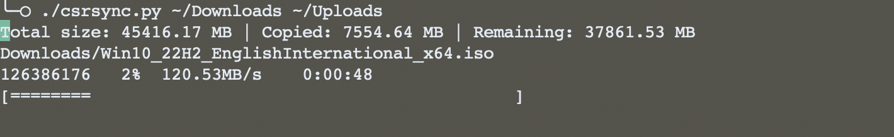

# copy-stats-rsync

`copy-stats-rsync` is a Python script that provides a visual progress bar and real-time statistics for the `rsync` command. It aims to enhance the user experience when transferring files or directories by displaying useful information about the ongoing syncronization process.

## Features

- Real-time display of total size, copied size, and remaining size.
- Interactive progress bar for visual feedback.
- Designed to work with both single files and directories.
- Supports synchronization between local and remote destinations. [No detailed stats for remote destinations yet].

## Prerequisites

- Python 3
- `rsync` 

## Usage

    python csrsync.py <source_file_or_directory> <destination_directory>

or,

    chmod +x csrsync.py
    ./csrsync.py  <source_file_or_directory> <destination_directory>

## Example

    ./csrsync.py ~/Downloads/example.txt ~/Backup

## License

This project is licensed under the MIT License - see the LICENSE file for details.

